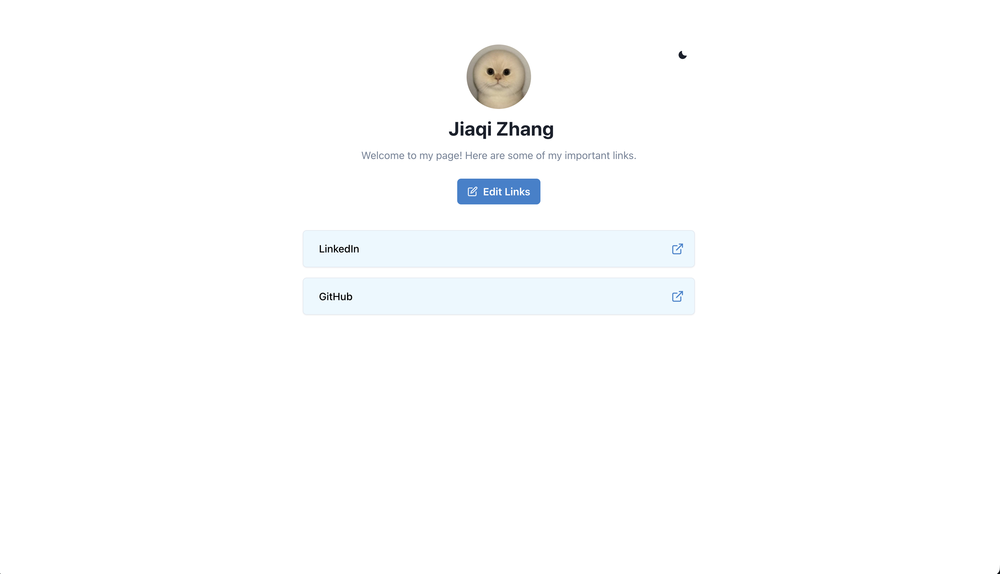
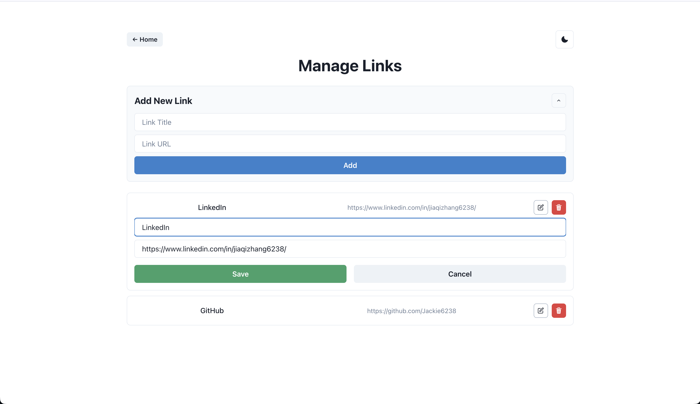
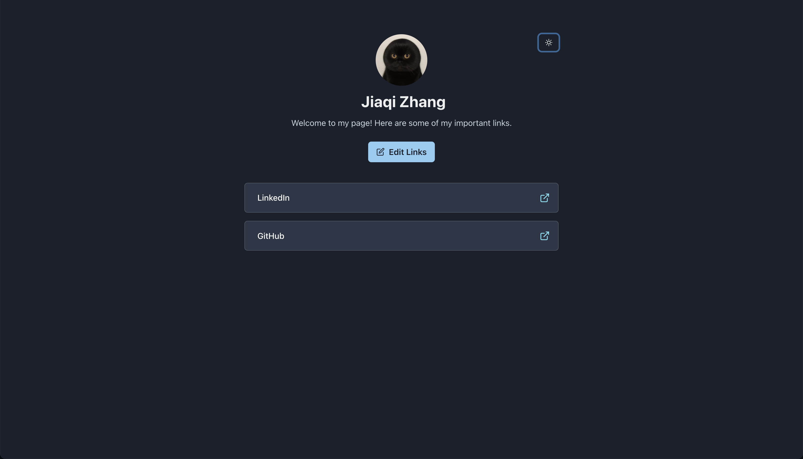
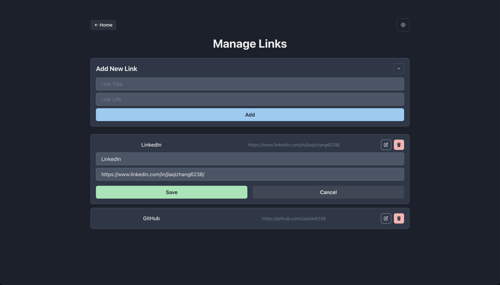

# MERN Bio-Link Manager

A full-stack "link-in-bio" application built with the MERN stack (MongoDB, Express, React, Node.js) and TypeScript. It provides a simple, clean public page to display a list of important links and a private admin dashboard to manage them.

## Screenshots

### Light Mode

**Public Page**  


**Admin Dashboard**  


### Dark Mode

**Public Page**  


**Admin Dashboard**  


---

## Features

- **Public-Facing Page**: A clean, responsive "link-in-bio" style page to display all your links.
- **Dark/Light Mode**: A theme toggle on the public page that respects system preference.
- **Admin Dashboard**: A separate page at the `/admin` route for full CRUD (Create, Read, Update, Delete) management of links.
- **Inline Editing**: Click on any link in the admin panel to expand an inline editing form.
- **Modern UI**: Built with **Chakra UI** for a beautiful, responsive, and accessible user interface.
- **RESTful API**: A backend built with Express.js and Mongoose for interacting with the MongoDB database.
- **Fully Typesafe**: Uses TypeScript on both the frontend and backend to ensure type safety and improve developer experience.

---

## Tech Stack

- **Frontend**:
  - React
  - TypeScript
  - Vite
  - Chakra UI
  - Axios
  - React Router
- **Backend**:
  - Node.js
  - Express.js
  - TypeScript
  - Mongoose
- **Database**:
  - MongoDB

---

## Getting Started

Follow these instructions to get a copy of the project up and running on your local machine for development and testing purposes.

### Prerequisites

- Node.js (v18 or later recommended)
- npm or yarn
- MongoDB (running locally or a connection string to a cloud instance like MongoDB Atlas)

### Installation

1.  **Clone the repository:**

    ```bash
    git clone [https://github.com/your-username/your-repo-name.git](https://github.com/your-username/your-repo-name.git)
    cd your-repo-name
    ```

2.  **Set up the Backend (Server):**

    ```bash
    # Navigate to the server directory
    cd server

    # Install dependencies
    npm install

    # Create a .env file from the example
    cp .env.example .env
    ```

    Now, open `server/.env` and add your MongoDB connection string:

    ```env
    # .env
    PORT=4000
    MONGO_URI=mongodb://127.0.0.1:27017/biolinkdb
    ```

3.  **Set up the Frontend (Client):**

    ```bash
    # Navigate to the client directory from the root
    cd client

    # Install dependencies
    npm install

    # Create a .env.local file from the example
    cp .env.local.example .env.local
    ```

    The `client/.env.local` file should point to your backend server URL. The default is already set up for local development.

    ```env
    # .env.local
    VITE_API_URL=http://localhost:4000
    ```

### Running the Application

You will need to run the backend and frontend in two separate terminals.

1.  **Run the Backend Server:**

    ```bash
    # In the /server directory
    npm run dev
    ```

    The server should now be running on `http://localhost:4000`.

2.  **Run the Frontend Client:**
    ```bash
    # In the /client directory
    npm run dev
    ```
    The React app should now be running on `http://localhost:5173`.

You can now access the public page at `http://localhost:5173` and the admin panel at `http://localhost:5173/admin`.

---

## API Endpoints

The server exposes the following RESTful API endpoints:

| Method   | Endpoint         | Description               |
| :------- | :--------------- | :------------------------ |
| `GET`    | `/api/links`     | Fetches all links.        |
| `POST`   | `/api/links`     | Creates a new link.       |
| `PUT`    | `/api/links/:id` | Updates an existing link. |
| `DELETE` | `/api/links/:id` | Deletes a specific link.  |

---

## Future Improvements

- **Authentication**: Secure the `/admin` route so that only logged-in users can manage links.
- **Drag-and-Drop Reordering**: Allow the admin to reorder links on the dashboard.
- **Analytics**: Track the number of clicks for each link.
- **Deployment**: Add scripts and instructions for deploying to services like Vercel (frontend) and Render (backend).
